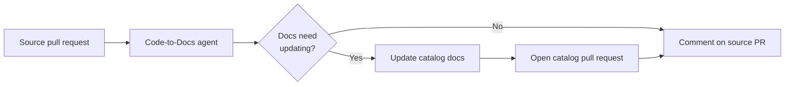
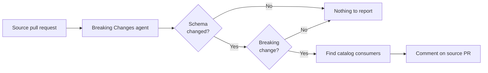

# EventCatalog Agents

> [!NOTE]
> **Early access / beta.** EventCatalog Agents are free for anyone to evaluate today. In the future,
> a license will be required to run EventCatalog Agents in production. See [License](#license).

AI agents that help you manage and document your architecture with
[EventCatalog](https://www.eventcatalog.dev).

EventCatalog Agents understand EventCatalog conventions — services, events, commands, queries,
domains, channels, containers, specifications, and more — and use that understanding to keep your
architecture documented and safe to change. They are powered by [Flue](https://flueframework.com) and
guided by bundled Agent Skills.

Today the agents run in your **CI/CD pipeline as a GitHub Action**: each time you open a pull request,
the agents you've enabled review the change and report back. CI is the first place we run them; it is
a delivery surface, not the limit of what the agents are.

## Available agents

| Agent                                     | What it does                                                                                          |
| ----------------------------------------- | ----------------------------------------------------------------------------------------------------- |
| [**Code-to-Docs**](#code-to-docs)         | Keeps your EventCatalog documentation in sync with your code by proposing catalog updates on each PR. |
| [**Breaking Changes**](#breaking-changes) | Detects breaking schema changes in a PR and shows which catalog consumers could be affected.          |

Each Action step runs **one** agent, selected with the [`agent`](#choosing-an-agent) input (default:
`code-to-docs`). To run more than one, add another step (or workflow file) with a different `agent`.

## Code-to-Docs

The **Code-to-Docs** agent keeps your EventCatalog documentation in sync with your code. When you open
a pull request, it reviews the diff, works out which documentation should change, updates it in your
catalog repository, and opens (or updates) a documentation pull request — then comments back on your
source PR with a summary and a link.



### How it works

When a pull request is opened, the Code-to-Docs agent:

1. **Checks out your catalog** repository into `eventcatalog/`.
2. **Collects the changed source files** from the pull request (ignoring noise like `node_modules`,
   build output, etc.).
3. **Plans the impact** — a read-only pass where the agent decides whether the diff requires any
   documentation changes, and if so, exactly which catalog resources should change. If nothing is
   needed, the run stops here and says so.
4. **Applies the plan** — the agent updates the catalog documentation, using the bundled
   EventCatalog skill for correct frontmatter and folder structure, and a linter to validate its
   changes. It is only allowed to touch the resources approved in the plan; edits outside that plan
   are rejected.
5. **Opens a catalog PR** — commits the changes to an `eventcatalog-actions/...` branch in your
   catalog repository and opens or updates a pull request against `catalog-ref`.
6. **Comments on the source PR** with a high-level summary and a link to the catalog PR.

Deterministic work (diff parsing, path resolution, git writes, token preflight, change detection)
stays in TypeScript. The agent is responsible only for reasoning about documentation.

## Breaking Changes

The **Breaking Changes** agent watches your message schemas. When a pull request changes a schema, it
decides whether the change is breaking for existing consumers and, if so, traces it through your
EventCatalog to the resources that could be affected — then comments back on your source PR with the
breaking lines highlighted and the affected consumers listed. It is read-only: it never edits your
catalog.



### How it works

When a pull request is opened, the Breaking Changes agent:

1. **Checks out your catalog** repository into `eventcatalog/`.
2. **Finds changed schema files** in the pull request (`.json`, `.yml`, Avro, Protobuf, GraphQL, and
   similar). If the PR touches no schemas, the run stops here.
3. **Scores each schema change** — a read-only pass that decides whether the change is breaking
   (a removed/renamed field, a type change, a new required field, a narrowed enum, and so on).
   Additive changes are not breaking and are skipped.
4. **Finds affected consumers** — for each breaking change, the agent traces the schema to the
   resource it belongs to and finds the services and flows that consume it (the producer that sends
   the message is not counted).
5. **Comments on the source PR** with each breaking change, its highlighted lines, and the consumers
   that could be affected. If no consumers are found, it logs that and skips the comment.

## Get started

Run an agent on your repository in three steps.

**1. Add your model provider key** as a secret in your repository (Settings → Secrets and variables →
Actions). Use the one that matches your chosen model — e.g. `ANTHROPIC_API_KEY`, `OPENAI_API_KEY`, or
`OPENROUTER_API_KEY`.

**2. Add a workflow** at `.github/workflows/eventcatalog.yml`:

```yaml
on:
  pull_request:

jobs:
  eventcatalog:
    runs-on: ubuntu-latest
    permissions:
      contents: read
      issues: write
      pull-requests: write
    steps:
      - uses: actions/checkout@v6
        with:
          fetch-depth: 0

      - uses: event-catalog/agents@main
        env:
          ANTHROPIC_API_KEY: ${{ secrets.ANTHROPIC_API_KEY }}
        with:
          agent: code-to-docs # or: breaking-changes
          catalog-repo: your-org/your-catalog
          catalog-token: ${{ secrets.EVENTCATALOG_TOKEN }}
```

**3. Open a pull request.** The selected agent runs and reports back on your source PR.

> `fetch-depth: 0` is required so the agent can diff the pull request against its base. See
> [Inputs](#inputs) for all configuration options.

### Choosing an agent

Each Action step runs a single `agent`. To run more than one, add another step in the same job (or a
second workflow file):

```yaml
- uses: event-catalog/agents@main
  env:
    ANTHROPIC_API_KEY: ${{ secrets.ANTHROPIC_API_KEY }}
  with:
    agent: code-to-docs
    catalog-repo: your-org/your-catalog
    catalog-token: ${{ secrets.EVENTCATALOG_TOKEN }}

- uses: event-catalog/agents@main
  env:
    ANTHROPIC_API_KEY: ${{ secrets.ANTHROPIC_API_KEY }}
  with:
    agent: breaking-changes
    catalog-repo: your-org/your-catalog
    catalog-token: ${{ secrets.EVENTCATALOG_TOKEN }}
```

## Configuration

### Inputs

| Input           | Required | Default                       | Description                                                                          |
| --------------- | -------- | ----------------------------- | ------------------------------------------------------------------------------------ |
| `agent`         | No       | `code-to-docs`                | Which agent to run: `code-to-docs` or `breaking-changes`.                            |
| `catalog-repo`  | Yes      |                               | EventCatalog repository to read/document, in `owner/repo` format.                    |
| `catalog-ref`   | No       | `main`                        | Branch checked out from the catalog repository and targeted by documentation PRs.    |
| `catalog-token` | No       | `github.token`                | Token used to check out the catalog repository and open documentation pull requests. |
| `model`         | No       | `anthropic/claude-sonnet-4-6` | Model specifier for the agent. See [available models](https://pi.dev/models).        |
| `ignore-paths`  | No       | see [action.yml](action.yml)  | Comma-separated paths or glob patterns to ignore in PR diffs.                        |

The agents run on [Flue](https://flueframework.com), which supports models from many providers — see
the full list of model specifiers at [pi.dev/models](https://pi.dev/models).

### Provider API keys

The model provider's API key is passed as a normal workflow environment variable. Set the one that
matches your `model`:

| Provider   | Env var              |
| ---------- | -------------------- |
| Anthropic  | `ANTHROPIC_API_KEY`  |
| OpenAI     | `OPENAI_API_KEY`     |
| OpenRouter | `OPENROUTER_API_KEY` |

### Using a separate catalog repository

The catalog is always checked out to `eventcatalog/` under `$GITHUB_WORKSPACE`. When your catalog
lives in a **different** repository from your source code, provide a `catalog-token` with permission
to read it — and, for Code-to-Docs, to push branches and open pull requests in it (the default
`github.token` only has access to the current repository).

## Development

This project uses [pnpm](https://pnpm.io) and requires Node.js `>=22.19.0` (Flue's minimum; CI uses
Node 24).

```sh
pnpm install

# Build + typecheck + run the eval suite
pnpm test

# Run only the evals (see evals/README.md)
pnpm run evals

# Run an agent locally against a checked-out workspace
# (pr-review = Code-to-Docs, breaking-changes = Breaking Changes)
pnpm exec flue run pr-review --root . --target node --payload '{"workspace":"/tmp/example"}'
```

See [`AGENTS.md`](AGENTS.md) for the project layout and contributor guidelines, and
[`evals/README.md`](evals/README.md) for how the agents are evaluated.

## License

This project is source-available under the [Business Source License 1.1](LICENSE).

You are free to read the code, modify it, and contribute, and to use it for non-production
purposes such as evaluation, development, and testing. **Production use requires a commercial
EventCatalog license** — contact hello@eventcatalog.dev. Each release converts to the Apache
License 2.0 four years after it is published.
