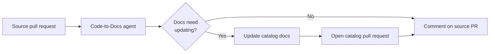

# EventCatalog Agents

> [!NOTE]
> **Early access / beta.** EventCatalog Agents are free for anyone to evaluate today. In the future,
> a license will be required to run EventCatalog Agents in production. See [License](#license).

AI agents that help you manage and document your architecture with
[EventCatalog](https://www.eventcatalog.dev).

EventCatalog Agents understand EventCatalog conventions — services, events, commands, queries,
domains, channels, containers, specifications, and more — and use that understanding to keep your
architecture documented for you. They are powered by [Flue](https://flueframework.com) and guided by
bundled [Agent Skills](#how-it-works).

## The Code-to-Docs agent

The first agent — and currently the only one — is **Code-to-Docs**: it keeps your EventCatalog
documentation in sync with your code.

Today it runs in your **CI/CD pipeline as a GitHub Action**: when you open a pull request, the agent
reviews the diff, works out which documentation should change, updates it in your catalog repository,
and opens (or updates) a documentation pull request — then comments back on your source PR with a
summary and a link. CI is the first place we run it; it is a delivery surface, not the limit of what
the agent is.



### Get started

Run the Code-to-Docs agent on your repository in three steps.

**1. Add your model provider key** as a secret in your repository (Settings → Secrets and variables →
Actions). Use the one that matches your chosen model — e.g. `ANTHROPIC_API_KEY`, `OPENAI_API_KEY`, or
`OPENROUTER_API_KEY`.

**2. Add a workflow** at `.github/workflows/eventcatalog.yml`:

```yaml
on:
  pull_request:

jobs:
  eventcatalog:
    runs-on: ubuntu-latest
    permissions:
      contents: read
      issues: write
      pull-requests: write
    steps:
      - uses: actions/checkout@v6
        with:
          fetch-depth: 0

      - uses: event-catalog/agents@main
        env:
          ANTHROPIC_API_KEY: ${{ secrets.ANTHROPIC_API_KEY }}
        with:
          catalog-repo: your-org/your-catalog
          catalog-token: ${{ secrets.EVENTCATALOG_TOKEN }}
```

**3. Open a pull request.** The agent reviews the diff and, if your architecture changed, opens a
documentation pull request in your catalog repository and comments back with a link.

> `fetch-depth: 0` is required so the agent can diff the pull request against its base. See
> [Inputs](#inputs) for all configuration options.

### How it works

When a pull request is opened, the agent:

1. **Checks out your catalog** repository into `eventcatalog/`.
2. **Collects the changed source files** from the pull request (ignoring noise like `node_modules`,
   build output, etc.).
3. **Plans the impact** — a read-only pass where the agent decides whether the diff requires any
   documentation changes, and if so, exactly which catalog resources should change. If nothing is
   needed, the run stops here and says so.
4. **Applies the plan** — the agent updates the catalog documentation, using the bundled
   EventCatalog skill for correct frontmatter and folder structure, and a linter to validate its
   changes. It is only allowed to touch the resources approved in the plan; edits outside that plan
   are rejected.
5. **Opens a catalog PR** — commits the changes to an `eventcatalog-actions/...` branch in your
   catalog repository and opens or updates a pull request against `catalog-ref`.
6. **Comments on the source PR** with a high-level summary and a link to the catalog PR.

Deterministic work (diff parsing, path resolution, git writes, token preflight, change detection)
stays in TypeScript. The agent is responsible only for reasoning about documentation.

### Configuration

#### Inputs

| Input           | Required | Default                       | Description                                                                                 |
| --------------- | -------- | ----------------------------- | ------------------------------------------------------------------------------------------- |
| `catalog-repo`  | Yes      |                               | EventCatalog repository to document into, in `owner/repo` format.                           |
| `catalog-ref`   | No       | `main`                        | Branch checked out from the catalog repository and targeted by documentation PRs.           |
| `catalog-token` | No       | `github.token`                | Token used to check out the catalog repository and open documentation pull requests.        |
| `model`         | No       | `anthropic/claude-sonnet-4-6` | Model specifier for the documentation agent. See [available models](https://pi.dev/models). |
| `ignore-paths`  | No       | see [action.yml](action.yml)  | Comma-separated paths or glob patterns to ignore in PR diffs.                               |

The agent runs on [Flue](https://flueframework.com), which supports models from many providers — see
the full list of model specifiers at [pi.dev/models](https://pi.dev/models).

#### Provider API keys

The model provider's API key is passed as a normal workflow environment variable. Set the one that
matches your `model`:

| Provider   | Env var              |
| ---------- | -------------------- |
| Anthropic  | `ANTHROPIC_API_KEY`  |
| OpenAI     | `OPENAI_API_KEY`     |
| OpenRouter | `OPENROUTER_API_KEY` |

#### Documenting into a separate catalog repository

The catalog is always checked out to `eventcatalog/` under `$GITHUB_WORKSPACE`. When your catalog
lives in a **different** repository from your source code, provide a `catalog-token` with permission
to push branches and open pull requests in that catalog repository (the default `github.token` only
has access to the current repository).

## Development

This project uses [pnpm](https://pnpm.io) and requires Node.js `>=22.19.0` (Flue's minimum; CI uses
Node 24).

```sh
pnpm install

# Build + typecheck + run the eval suite
pnpm test

# Run only the evals (see evals/README.md)
pnpm run evals

# Run the workflow locally against a checked-out workspace
pnpm exec flue run pr-review --root . --target node --payload '{"workspace":"/tmp/example"}'
```

See [`AGENTS.md`](AGENTS.md) for the project layout and contributor guidelines, and
[`evals/README.md`](evals/README.md) for how the agent is evaluated.

## License

This project is source-available under the [Business Source License 1.1](LICENSE).

You are free to read the code, modify it, and contribute, and to use it for non-production
purposes such as evaluation, development, and testing. **Production use requires a commercial
EventCatalog license** — contact hello@eventcatalog.dev. Each release converts to the Apache
License 2.0 four years after it is published.
